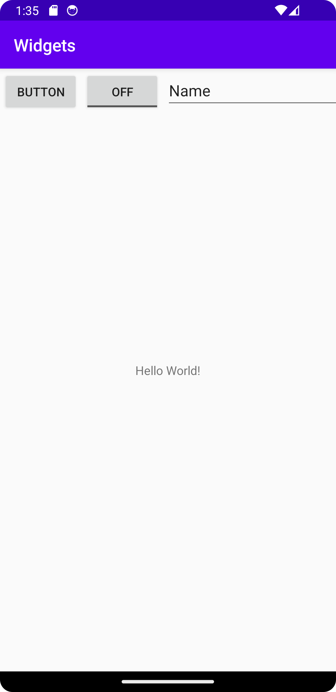

[
# Rapport
Jag har lagt till en linear layout, en "vanlig knapp", en on off knapp samt ett textfält. 
Avslutningsvis har jag bytt plats på de olika sakerna samt lagt till en margin, koden för marginen följer nedan.
Bilden på layouten finns som en separat fil.
```
fandroid:layout_marginStart="3dp"
            android:layout_marginTop="3dp"
            android:layout_marginEnd="3dp"
            android:layout_marginBottom="3dp"
```



